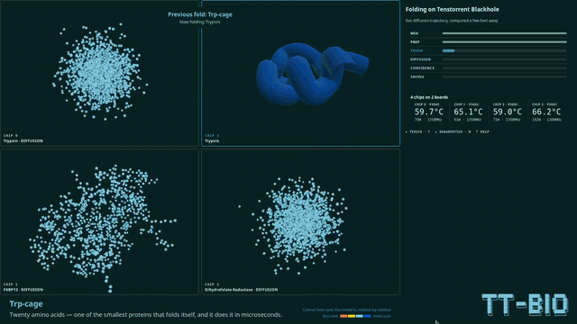
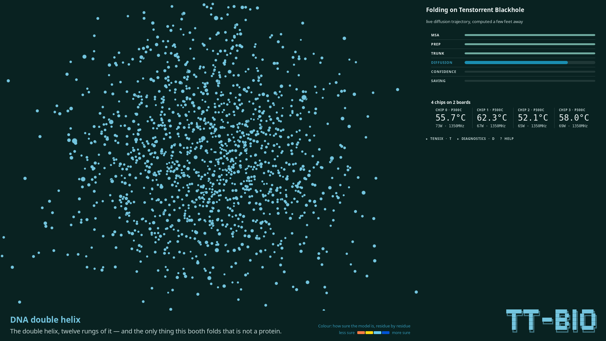
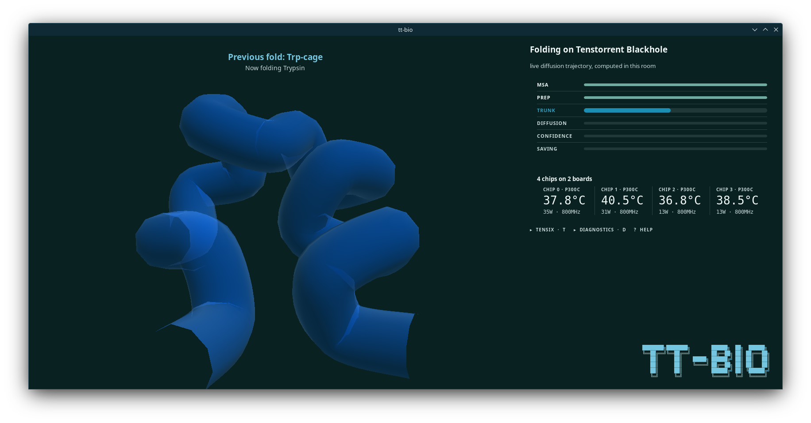
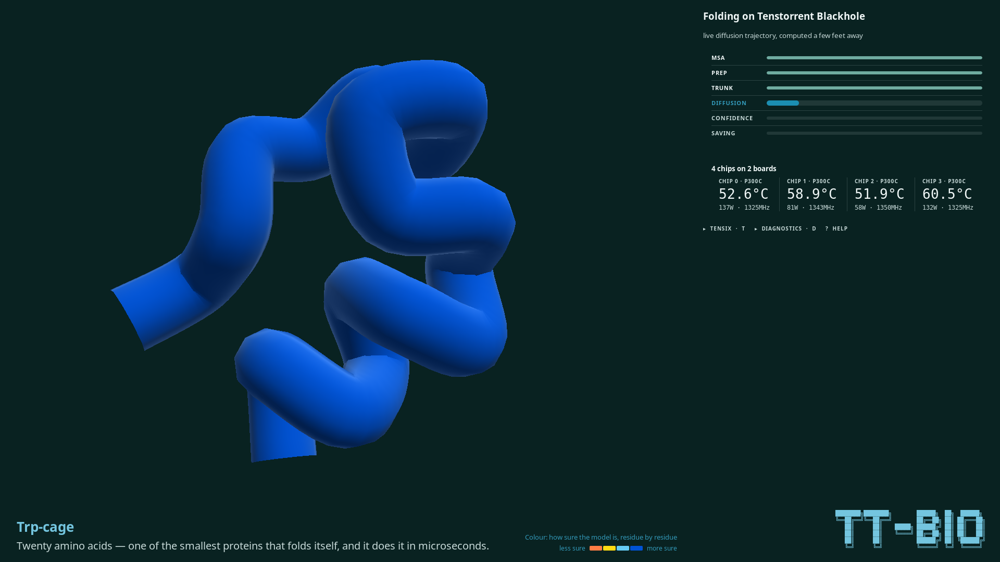
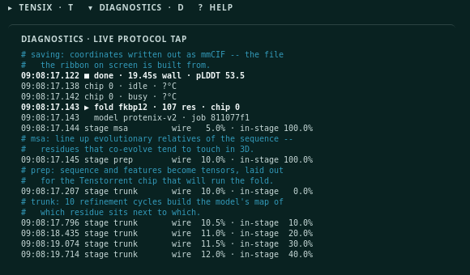
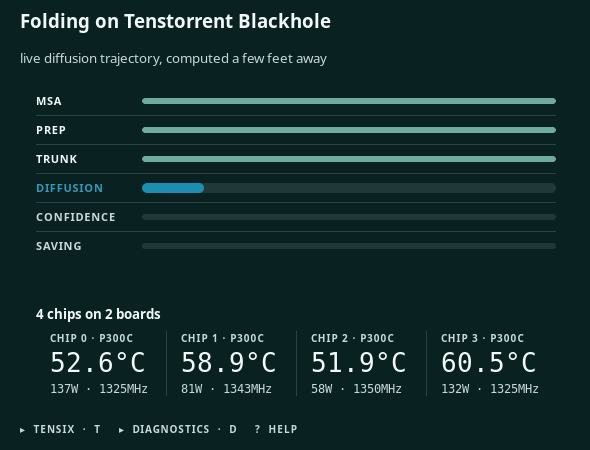

# tt-bio-demo

A turnkey conference demo for [tt-bio](https://github.com/moritztng/tt-bio) — protein
structure prediction on Tenstorrent hardware.

Watch a protein condense out of noise into its folded structure, in real time, computed on
the Blackhole chips a few feet away. Native GTK4 and OpenGL — with [one scoped
exception](#the-one-webkit-exception) for a small hardware-activity animation.

<video src="docs/screenshots/booth-loop-30s.mp4" autoplay loop muted playsinline width="100%"></video>

<!-- GitHub renders the <video> above. Anywhere that strips HTML falls back to this GIF,
     which is the same footage cut shorter to keep it a sane size. -->
[](docs/screenshots/booth-loop-30s.mp4)

*Thirty seconds of the booth, captured at 1920×1080 · 60 fps from the running application —
FKBP12, Trp-cage, trypsin and DHFR in turn on a Blackhole p300c. Those dots are the model's
actual denoising trajectory, streamed one step at a time and condensing into structure; the
right-hand rail is the live protocol tap showing the same events arrive. Every image on this
page is the real thing on real silicon — no mockups, no reconstructions.*

---

## What it looks like

Every image below is the real application folding on a Blackhole p300c — no mockups, no
reconstructions.

### The fold, in flight



865 atoms mid-collapse. The point cloud is the model's actual denoising trajectory,
streamed a step at a time — not an animation of a finished result. Press <kbd>T</kbd> for
the Tensix core grid, <kbd>D</kbd> for the live protocol tap.

### Never a blank screen



Only the diffusion stage produces coordinates, so a big protein spends its first ~15 s in
`trunk` with nothing to draw. Rather than showing black, the viewer holds the last **real**
structure — dimmed, and captioned with what it is and what is computing now. Nothing is
ever fabricated: what you see was actually computed.

### The reveal



Trp-cage, coloured by the model's own per-residue confidence.

### What it is actually doing



The live protocol tap, with a plain-language line for each stage. Bounded ring buffer — the
booth runs unattended all day.

### The instrument



Pipeline stages and per-chip telemetry, sampled independently of the compute daemon so the
silicon keeps visibly breathing even if the daemon wedges.

**Four chips on two boards.** A p300c carries two chips, so `tt-smi`'s four entries are four
chips — not four boards. The panel says so, because a visitor reading "4 cards" would
picture the wrong machine. Folds are timed on this hardware, warm: Trp-cage **4.4 s**,
FKBP12 **11.7 s**, DHFR **19.7 s**, trypsin **22.3 s**.

---

## Quick start

On a box with a Tenstorrent device, from a fresh clone:

```bash
./scripts/setup-venvs.sh --dev     # build both venvs (one-time, ~minutes)
./scripts/run-demo.sh              # start the daemon + UI, fold on real silicon
```

Ctrl-C tears the daemon down cleanly. Without hardware, the renderer still runs against a
recorded trajectory — see [Running without hardware](#running-without-hardware).

```bash
./scripts/test.sh                  # full suite, software only
./scripts/test.sh --hw             # also run the tests that open the chips
```

---

## Usage

### 1. Set up the environments

This project owns its Python environments; it does not use a system or personal venv.

```bash
./scripts/setup-venvs.sh --dev
```

That creates two:

| venv | Built how | Holds | Never holds |
|---|---|---|---|
| `.venvs/venv-ui` | system `python3` + `--system-site-packages` | PyGObject (GTK4), gemmi, PyOpenGL, numpy | torch, tt-bio |
| `.venvs/venv-runner` | isolated | torch, ttnn, tt-bio (pinned release), vendored SFPI | GTK |

They are split because tt-bio needs a torch/ttnn stack and GTK needs apt's `python3-gi`;
keeping them apart removes the conflict rather than managing it, and means the UI holds no
device handles and cannot be taken down by a wedged chip.

Useful flags:

- `--dev` — also install pytest into `venv-runner`, needed to run the runner-side tests.
  Off by default, because `venv-runner` is the same artifact a Debian build produces and
  test tooling should not ship to a booth machine.
- `--force` — rebuild from scratch. A second run without it is a ~0.3–0.5 s no-op.
- `--skip-runner` — skip the expensive half while iterating on the UI.
- `--prefix PATH` — build somewhere other than `.venvs/` (production uses
  `/opt/tt-bio-demo`; same script, same code paths, different argument).
- `--strict` — treat "venv-runner installed but its stack won't import, or its device
  probe failed" as a hard failure rather than exit 2.

Exit codes: `0` fully working (including "no Tenstorrent hardware present"), `1` hard
failure, `2` runner venv built but non-functional.

> **Do not run `tt-bio install-deps`.** Installing Tenstorrent system packages and kernel
> modules is a packaging-phase decision that needs explicit consent; nothing in this repo
> does it for you.

### 2. Run the demo

```bash
./scripts/run-demo.sh
```

This starts the compute daemon in `venv-runner` and the GTK4 UI in `venv-ui` and wires them
over a Unix socket. A protein renders driven entirely by live computation on a chip — no
recorded fixture anywhere in this path.

**One playlist drives both processes.** The launcher reads `playlist/manifest.yaml`,
expands the selected entries into the directory of fold inputs the daemon reads, and hands
the UI the same manifest and the same selection. That is deliberate and it is load-bearing:
before this, the daemon got one target and the UI defaulted to the full four-target
manifest, so the gallery advertised proteins the daemon had no input file for.

Every option has an environment-variable equivalent; `./scripts/run-demo.sh --help` prints
the authoritative list. The ones you are most likely to want:

| Flag | Default | What it does |
|---|---|---|
| `--socket PATH` | `${XDG_RUNTIME_DIR:-/tmp}/tt-bio-demo/runner.sock` | Socket the daemon serves and the UI connects to |
| `--playlist FILE` | `playlist/manifest.yaml` | The playlist **manifest** both processes are driven from |
| `--targets a,b` | `trpcage` | Which manifest ids to run, for both processes |
| `--all-targets` | off | Run every target in the manifest instead |
| `--log-root PATH` | `<runtime-dir>/logs` | Where tt-metal's own log output is pinned |
| `--log-budget-gb` | 2 | Sweep budget for tt-metal logs between folds |
| `--structures-budget-gb` | 0.2 | Sweep budget for emitted `.cif` structures, per device |

**The default is every target in the manifest** — the booth shows what it can do rather
than the one safe thing. A full cycle is ~63 s: Trp-cage 4.4 s, FKBP12 11.7 s, DHFR 19.7 s,
trypsin 22.3 s, DNA 4.6 s, all measured warm on this hardware. Use `--targets trpcage` to
fold a single target while iterating, which is much faster.

The four proteins ship because they need no MSA server; most curated tt-bio playlist
entries do need one, and the venue is offline. The fifth target is a **DNA duplex** — the
Dickerson–Drew dodecamer — which needs no alignment for a different reason: base-pairing
is chemistry, not evolutionary inference. It is also the target that shows what the
ribbon's colours are worth. It comes back at mean pLDDT 95.7 where the three larger
MSA-less proteins come back at 50.8, 52.9 and 39.5, and the confidence legend under the
render is what lets a visitor read that off the screen for themselves.

> **`--all-targets` is not yet validated end to end.** The other three shipped targets
> (FKBP12, DHFR, Trypsin) are measured 62–75 s folds, and their long callback-free windows —
> host featurization, then the confidence head and mmCIF write — have never been run through
> the socket into the UI, whose read timeout is 5 s. Watch a full cycle yourself before
> leaving one of them running unattended in front of the public.

### 3. Run the tests

```bash
./scripts/test.sh            # both venvs, software only
./scripts/test.sh --hw       # additionally run tests/integration, which opens the chips
```

The suite spans both environments and `test.sh` runs each half under its own interpreter —
UI tests in `venv-ui`, runner tests in `venv-runner`. It fails if either half fails, and
also if either half's path selector matches **zero** tests, since a silently empty half
looks identical to a passing one.

**The hardware half is opt-in.** `tests/integration/` opens every Tenstorrent chip on the
box. On a shared machine that is antisocial — mutation testing alone re-runs the suite a
dozen times per change — so it only runs with `--hw` (or `TT_BIO_DEMO_HW_TESTS=1`). The
skip is announced before the run and restated in the verdict, so a software-only pass can
never be mistaken for one that exercised the silicon:

```
hardware:    SKIPPED -- pass --hw (or TT_BIO_DEMO_HW_TESTS=1) to run them
OVERALL: PASS (both halves green, hardware tests NOT run)
```

Anything after the flag is passed through to pytest: `./scripts/test.sh -k telemetry -v`.

### Running without hardware

The renderer's own test suite and the mock runner (`runner/mock.py`) replay a recorded fold
trajectory at the protocol's real pace, so the whole UI — noise cloud, contraction,
cross-fade, rotating pLDDT ribbon — works on any Linux box with no Tenstorrent chip
attached. `./scripts/test.sh` is fully green on such a machine.

### Never type a bare `python3`

On a provisioned Tenstorrent box, `python3` resolves to a Tenstorrent venv that has neither
gemmi nor GTK, and the failure is confusing rather than loud. Use the project's venvs:

```bash
.venvs/venv-ui/bin/python3 -m ui.app          # the UI alone
.venvs/venv-runner/bin/python3 -m runner.daemon --help
```

---

## How it fits together

```
 runner/  (venv-runner)                    ui/  (venv-ui)
 ┌──────────────────────┐                  ┌──────────────────────┐
 │ opens the device     │   Unix socket    │ GtkGLArea renderer   │
 │ holds model resident │ ───────────────► │ telemetry + pipeline │
 │ folds, emits events  │  newline JSON    │ reconnects on drop   │
 └──────────────────────┘                  └──────────────────────┘
              └──────── protocol/ ────────┘
                 (stdlib + numpy only,
                  imported by both venvs)
```

`protocol/` is the only code both environments import, which is why it is restricted to the
standard library and numpy — anything richer would have to exist in both stacks. It holds
the event schema, the stage order, and the per-stage progress bands.

### The one WebKit exception

This README used to say "no browser" flatly. That is not true and has not been since the
Tensix activity panel shipped, so here is what is actually the case.

`ui/chipviz.py` renders one `WebKit.WebView` in the 430 px side rail, holding a vendored copy
of [tensix-viz](ui/assets/tensix-viz/PROVENANCE.md) — the small animated Tensix core grids
under the chip readouts. **The 3D protein is not a browser and never will be**: it is a
`GtkGLArea` with this project's own shaders, and that — the part whose frame timing, colour
and provenance the booth is claiming to be real — is what "native GTK4" was always about.
The exception is scoped accordingly: the panel hides itself if WebKit is missing, if there
are no chips, or if the vendored assets cannot be read; it loads one inline `about:blank`
page and never navigates; it declares `default-src 'none'` so the engine itself refuses every
network source; and nothing in it can reach the viewer, the state machine or the socket.

**`WEBKIT_DISABLE_SANDBOX_THIS_IS_DANGEROUS=1`** is set by that module before WebKit is
imported, and it is load-bearing for the booth rather than a development convenience:

- Ubuntu 24.04 restricts unprivileged user namespaces by default
  (`kernel.apparmor_restrict_unprivileged_userns = 1`), which WebKitGTK's bubblewrap sandbox
  requires. Without it `bwrap` fails and WebKit answers with a `g_error`.
- A `g_error` is **not** a Python exception. It is SIGTRAP: it kills the process, and no
  `try/except` anywhere can catch it. Every other failure in that module degrades to a hidden
  panel; this one would abort the kiosk at startup, at the venue, with nothing on screen.
- The blast radius is one static, vendored, local page that renders no remote or
  user-supplied bytes — there is no hostile content for the sandbox to contain, and the CSP
  above enforces that rather than assuming it.
- It uses `setdefault`, so an operator on a machine where the sandbox does work can keep it
  on by exporting `WEBKIT_DISABLE_SANDBOX_THIS_IS_DANGEROUS=0`.

## What works today

- **Event protocol** — newline-delimited JSON over a Unix socket (`protocol/events.py`).
- **Compute daemon** (`runner/`) — opens a device once and holds the model resident across
  folds (~4.3–4.5 s warm vs. ~5.7 s cold), folds every `.yaml` in a playlist directory,
  samples `tt-smi` for chip health and quarantines an unsafe chip rather than handing it
  out, and contains tt-metal's own log output to a configured root with a swept budget.
- **Renderer** (`ui/`) — streams the live diffusion point cloud, then cross-fades into a
  pLDDT-colored ribbon. Ribbon geometry is built off the GTK main loop, and multi-chain
  structures are splined per chain rather than as one continuous tube. The socket client
  reconnects on any disconnect and keeps the last structure rotating rather than blanking.
- **The booth itself** — a five-state machine (attract, gallery, folding, showcase,
  preparing) with a 45 s idle reset, a curated playlist with visitor-facing blurbs and
  measured fold times, the `?` help card and the `D` diagnostics panel, and a "preparing"
  screen for when the daemon reports it is not ready.
- **Telemetry sampler** (`ui/telemetry.py`) — samples `tt-smi` independently of the daemon,
  so a wedged daemon still leaves the silicon visibly breathing. Reports a genuine
  tri-state: a reading, an honest "no devices", or "no usable answer" — never fabricated
  zeros.
- **`scripts/run-demo.sh`** — the turnkey launcher, tearing the daemon down on Ctrl-C so a
  leaked device handle cannot block the next run.

## What it deliberately does not do yet

**A visitor cannot choose what folds next.** The gallery is a catalogue of what the booth
folds, not a queue you can jump: the socket protocol is one-way (the daemon broadcasts; the
UI never sends), so a tap closes the gallery and returns to the fold already running. The
daemon's priority queue exists and reserves a slot for exactly this, but the client→server
message does not exist yet. The gallery and the `?` help card both say so on screen; nothing
a visitor reads claims otherwise. When the protocol grows that message, `ui/app.py`'s
`_on_pick` and the copy in `ui/gallery.py` are what change together.

## What is on screen

```
┌──────────────────────────────┬───────────────────────┐
│                              │ Folding on Blackhole  │
│                              │ PIPELINE  ▓▓▓░░ stage │
│      the protein, or         │ CHIPS  °C · W · MHz   │
│      the gallery             │ TENSIX ACTIVITY  ▞▚▞▚ │
│                              │ ▸ DIAGNOSTICS · ? HELP│
│                              │ (diagnostics log)     │
└──────────────────────────────┴───────────────────────┘
```

- **The hero slot** holds either the live fold — the diffusion point cloud cross-fading
  into a pLDDT-coloured ribbon — or the gallery. The side rail stays put across both, so
  the silicon keeps visibly breathing while someone is reading.
- **Pipeline panel** — one row per fold stage (msa, prep, trunk, diffusion, confidence,
  saving); the bright row is the one running now. Clears itself if nothing reports progress
  for 20 s, so a dead daemon cannot leave a progress bar frozen mid-fold all day.
- **Chips panel** — temperature, power and clock per chip, from a `tt-smi` snapshot every
  two seconds on the UI's own thread. Never from the socket: a wedged daemon still leaves
  the hardware readout live. Reports a genuine tri-state and marks itself stale.
- **Tensix activity panel** — one animated core grid per chip
  ([the WebKit exception](#the-one-webkit-exception)). Only the chip actually running the
  fold animates the work; the header names it (`CHIP 0 · DENOISING`) and the AICLK figure
  beside it is read from the driver once a second.
- **Diagnostics panel** (`D`) — the live protocol log, in the rail: every event as it
  arrives, with a one-line explanation of each stage the first time it appears. For us and
  for the curious visitor; it closes itself after five minutes of no input.
- **Help card** (`?`) — what the booth is, what every key does, what each panel means, and
  the pLDDT legend. Works from any screen without pausing the fold, and closes itself after
  a minute of no input.

### Key bindings

| Key | What it does |
|---|---|
| `?` or `F1` | the help card, from any screen |
| `D` | show/hide the diagnostics panel |
| `Esc` | close the help card, or the diagnostics panel |
| any other key, or a tap anywhere | wake the booth and show what it folds |
| `Ctrl` + `F` | leave/return to fullscreen — for the operator |
| `Ctrl` + `Q` | quit — for the operator |

## Not yet built

Debian packaging, thumbnail art for the gallery cards, pre-cached MSAs (every shipped
target is `msa: empty` today), and the client→server protocol message a visitor's pick
would need — see [What it deliberately does not do yet](#what-it-deliberately-does-not-do-yet).
See [`docs/followups.md`](docs/followups.md) for known gotchas and
[`docs/superpowers/plans/`](docs/superpowers/plans/) for the phase plans.

## Troubleshooting

**`ModuleNotFoundError: gi` / `gemmi`** — you are running a bare `python3`. See
[above](#never-type-a-bare-python3).

**`scripts/test.sh` says a half matched zero tests** — that is a failure, not an empty
pass. Check the path selector, and any `-k`/`-m` you passed, actually match something in
that half.

**The suite passes but you expected hardware coverage** — check the verdict line. Hardware
tests are opt-in; pass `--hw`.

**A chip is missing from telemetry** — `tt-smi -s` prints the snapshot the sampler parses.
A chip the daemon has quarantined for temperature is deliberately withheld from scheduling.
Never run `tt-smi -r` on a shared machine.

**Inspector / `tt-triage`** — tt-metal's Inspector is disabled by default here, because it
holds a log file open and appending for the daemon's whole life, which no directory sweep
can reclaim while the process runs (`runner/env.py`'s docstring has the measured growth
rate). tt-metal warns that `tt-triage` degrades without it; nothing here uses `tt-triage`,
so the default trades it for a bounded log root. Set `TT_METAL_INSPECTOR=1` yourself before
launching to get it back — `runner_environ()` uses `setdefault` and never overrides you.

## Intended install

```bash
sudo apt install tt-bio-demo-all
```

On a freshly imaged QB2 this brings tt-bio, the model weights (including the OpenFold3
checkpoint), the curated content, and the application — and pre-warms the tt-metal kernel
cache so the first fold at the booth is a warm one. Not built yet.

## Requirements

- Tenstorrent QB2 — 2× p300c Blackhole **boards**, presenting **4 chips** (`tt-smi -s`
  lists one entry per chip; the two chips of a p300c share a `board_id`). Developed and
  tested there
- Ubuntu 24.04, Wayland
- Network at provisioning time; **none required at the venue**

## Project conventions

See [`CLAUDE.md`](CLAUDE.md) for the working log and decisions. In short: spec-first;
tt-bio pinned to a release tag, never `main`; nothing in the UI ever displays a stack trace
or raw error text; and every test is written so that it can actually fail.

---

## Credit and licensing

This demo is Apache-2.0. The science in it is not ours — it exists to show other
people's work running on Tenstorrent hardware:

- **[tt-bio](https://github.com/moritztng/tt-bio)** (MIT) by Moritz Thüning is what makes
  structure prediction run on Tenstorrent silicon at all. This project installs it from a
  pinned release, vendors four of its example inputs, and offers one patch back upstream.
- **Boltz-2 / Boltz-1** — Wohlwend, Corso, Passaro et al., the MIT-licensed code tt-bio
  builds on.
- **Protenix-v2** (ByteDance, Apache-2.0) — the model this booth folds with by default.
- **OpenFold3** — the OpenFold Consortium.

Sequences and reference structures come from the public literature and the Protein Data
Bank. See [`NOTICE`](NOTICE) for the full list, what is vendored versus merely depended on,
and the modifications made.
