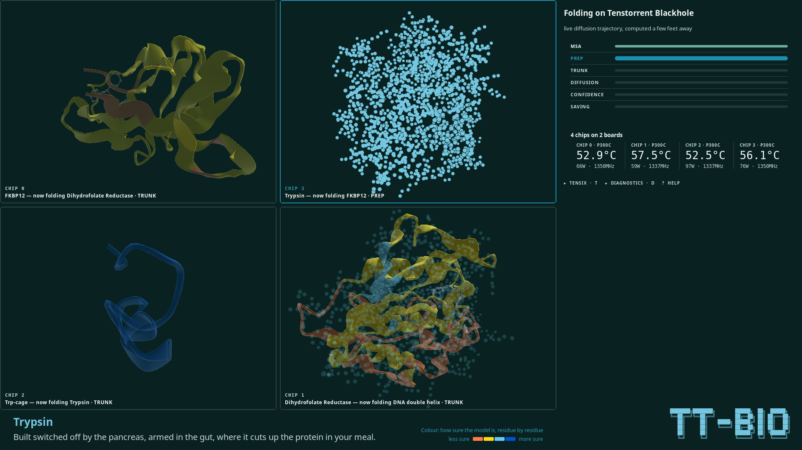
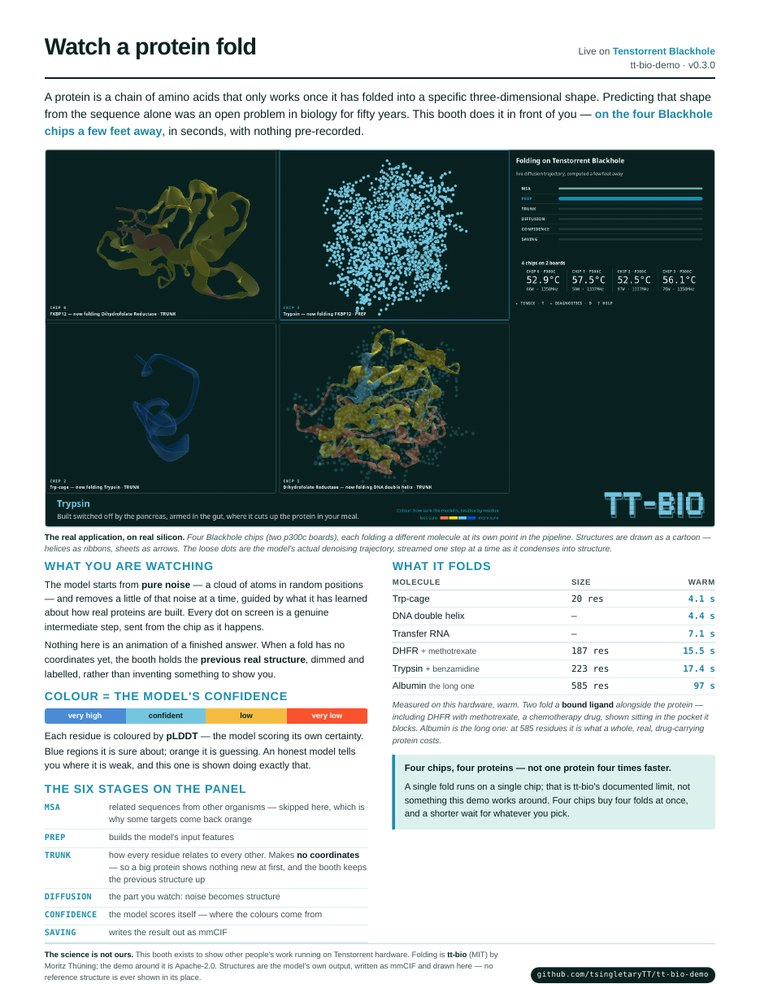
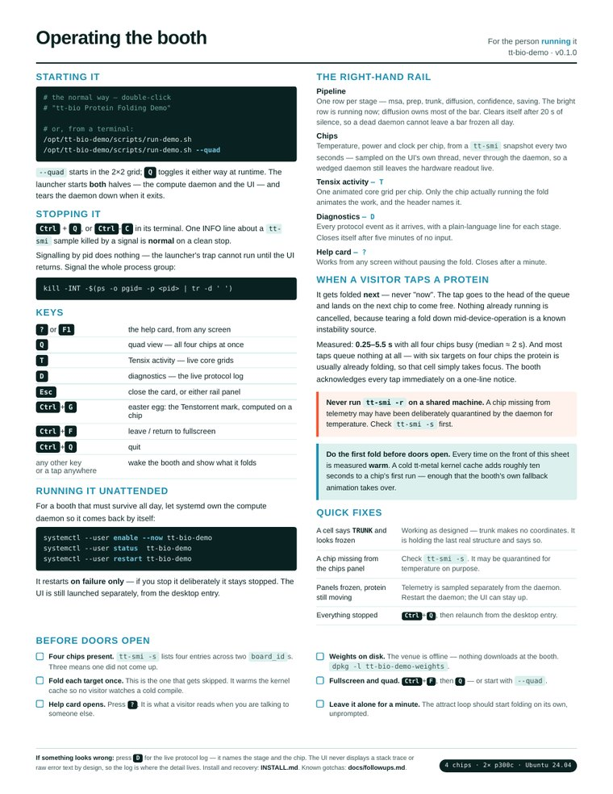

# tt-bio-demo

A turnkey conference demo for [tt-bio](https://github.com/moritztng/tt-bio) — protein
structure prediction on Tenstorrent hardware.

**[tsingletarytt.github.io/tt-bio-demo](https://tsingletarytt.github.io/tt-bio-demo/)** —
what the models do, the research they come from, and what this booth is showing.

Watch a protein condense out of noise into its folded structure, in real time, computed on
the Blackhole chips a few feet away. Native GTK4 and OpenGL — with [one scoped
exception](#the-one-webkit-exception) for a small hardware-activity animation.

<video src="docs/screenshots/booth-loop-30s.mp4" autoplay loop muted playsinline width="100%"></video>

<!-- GitHub renders the <video> above. Anywhere that strips HTML falls back to this GIF,
     which is the same footage cut shorter to keep it a sane size. -->
[](docs/screenshots/booth-loop-30s.mp4)

*Thirty seconds of the booth, captured at 1920&times;1080 · 60 fps from the running
application — the 2×2 quad view, four Blackhole chips (two p300c boards) each folding a different
molecule at its own point in the pipeline. Structures are drawn as a cartoon: helices as
ribbons, sheets as arrows. Those dots are the model's actual denoising trajectory, streamed
one step at a time and condensing into structure. The panels opening and closing are the
booth demonstrating its own instruments — it does that on its own when nobody has touched
it. Cut from a 170-second master in which 58 folds completed across all four chips. Every
image on this page is the real thing on real silicon — no mockups, no reconstructions.*

---

## What it looks like

Every image below is the real application folding on a Blackhole p300c — no mockups, no
reconstructions.

### The fold, in flight


865 atoms mid-collapse. The point cloud is the model's actual denoising trajectory,
streamed a step at a time — not an animation of a finished result. Press <kbd>T</kbd> for
the Tensix core grid, <kbd>D</kbd> for the live protocol tap.

### Never a blank screen


Only the diffusion stage produces coordinates, so a big protein spends its first ~15 s in
`trunk` with nothing to draw. Rather than showing black, the viewer holds the last **real**
structure — dimmed, and captioned with what it is and what is computing now. Nothing is
ever fabricated: what you see was actually computed.

### The reveal


Trp-cage, colored by the model's own per-residue confidence.

### What it is actually doing


The live protocol tap, with a plain-language line for each stage. Bounded ring buffer — the
booth runs unattended all day.

### Four chips at once



<kbd>Q</kbd> turns the single large protein into a 2×2 grid — one cell per chip, each
labeled with the chip it runs on, the protein, and the stage it has reached. Four
independent folds at four independent points in their pipelines, on one screen.

*(This section describes the base configuration, with the affinity-questions feature
disabled. When it is enabled on a 4-chip box, one chip is permanently reserved to answer
questions rather than fold — the quad and the `?` card both then show and say three chips,
not four, and every count on this page is the real one for whichever configuration is
actually running, not a hardcoded "four".)*

Each cell names its chip, what it is drawing, and what that chip has moved on to.
Three of these say `TRUNK`: only the diffusion stage produces coordinates, so a cell in
`trunk` keeps showing the **previous** fold rather than going black (see
[Never a blank screen](#never-a-blank-screen)) — and says so, naming both molecules.
Chip 3 is mid-diffusion, the cloud that has not become a shape yet.

Structures are drawn as a **cartoon**: helices as flat ribbons, sheets as arrows, loops as
thin tube — the representation used in every paper and textbook. The model's mmCIF carries
no secondary-structure records, so which residues are helix and which are sheet is worked
out from the C-alpha geometry (`ui/secstruct.py`).

Look at chips 0 and 1 and you can see a small molecule in the protein's pocket, drawn
ball-and-stick in the usual element colors. Three of the seven targets fold a **bound
ligand** alongside the protein — FKBP12 with a binder, trypsin with benzamidine, and DHFR
with methotrexate, the cancer drug its gallery card names.

A booth with more than one chip starts in the grid by itself; `scripts/run-demo.sh --solo`
forces the single large view, `--quad` forces the grid on a one-chip booth. <kbd>Q</kbd> still
toggles either way at runtime.

### The instrument


Pipeline stages and per-chip telemetry, sampled independently of the compute daemon so the
silicon keeps visibly breathing even if the daemon wedges.

**Four chips on two boards.** A p300c carries two chips, so `tt-smi`'s four entries are four
chips — not four boards. The panel says so, because a visitor reading "4 cards" would
picture the wrong machine. Folds are timed on this hardware, warm, on tt-bio 0.8.0: Trp-cage **4.6 s**,
FKBP12 **9.7 s**, DHFR **14.5 s**, trypsin **17.4 s**, albumin **95.5 s** — mean of two folds
each on chip 0, after discarding one cold-JIT-cache fold per target (a version bump recompiles
kernels for the new shapes; see `playlist/manifest.yaml`'s header). Chip 1 was not re-measured
this pass; the 0.5–1.4 s-slower drift measured on tt-bio 0.7.0 is a hardware/thermal property,
not a software one, so it is carried forward rather than restated as fresh: chips 1 and 3 settle
to a lower clock about fifteen minutes into a session (they idle 3–4 °C hotter than 0 and 2, so it is
chassis position rather than workload), and chip 1 was measured second, about thirteen minutes
in — its per-target *minima* match chip 0. A visitor's pick takes whichever chip is free, so a
long session drifts slower than these fresh-chip numbers. See `playlist/manifest.yaml` for the
full table.

**Four chips, four proteins — one protein per chip** (three, not four, when the
affinity-questions feature has reserved one chip for Q&A — see the note above). The booth
runs one worker process per fold chip, each pinned to its own physical device, each holding
its own resident copy of the model; press `Q` for the quad view and you are watching that
many independent folds at that many independent points in their pipelines. What that is
*not* is one protein folded faster with more chips: **a single target is a single-card
fold**, which is tt-bio's own documented limit and not something this demo works around.
More chips buy the booth more proteins at once, and they buy a visitor's pick a chip to land
on sooner — they do not make any one fold quicker.
Measured on this box: four workers reach "model resident, chip open" in **4.8 s** from a cold
start, and all four then fold Trp-cage concurrently to pLDDT 95.2–95.3.

---

## The handout

Everything above, printed — two sides of one sheet.
**[Download the PDF →](docs/tt-bio-demo-onepager.pdf)** · 2 pages · US Letter · 600 KB

| [](docs/tt-bio-demo-onepager.pdf) | [](docs/tt-bio-demo-onepager.pdf) |
|:--|:--|
| **Front — what you are watching**<br>For anyone who has just walked up to the booth: why a protein's shape matters, what the dots actually are, the confidence colors, and the six molecules with their measured fold times. | **Back — how to run it**<br>The operator's card: starting and stopping, every key binding, what each rail panel means, quick fixes, and a checklist for before the doors open. |

Rebuild it after changing fold times, key bindings or `VERSION` with
[`docs/onepager/build.sh`](docs/onepager/build.sh) — it re-renders from
`onepager.html.tmpl` and asserts the result is still exactly two pages.

Putting a booth machine together is [`INSTALL.md`](INSTALL.md), which starts from a QB2 that
has just had `tt-installer` run on it.

---

## Quick start

On a box with a Tenstorrent device, from a fresh clone:

```bash
./scripts/setup-venvs.sh --dev     # build both venvs AND fetch the weights
./scripts/run-demo.sh              # start the daemon + UI, fold on real silicon
```

`setup-venvs.sh` fetches the ~6.9 GB of model weights as its last step (protenix-v2 + CCD to
fold, nesso1 + its own CCD dict + the ESM-2 encoder to answer affinity questions), so a fresh
clone ends up able to fold and answer rather than able to start. Pass `--skip-weights` to opt
out of all of it; the download is resumable and re-running the script is a cheap no-op once
they are there.

**If the booth is going to a venue, do this before it leaves** — the venue is offline.
[`scripts/doctor.sh`](#is-this-machine-ready--scriptsdoctorsh) is the check, and it names
the command to run if anything is missing:

```bash
.venvs/venv-runner/bin/tt-bio weights --download protenix-v2
```

Ctrl-C tears the daemon down cleanly. Without hardware, the renderer still runs against a
recorded trajectory — see [Running without hardware](#running-without-hardware).

```bash
./scripts/test.sh                  # full suite, software only
./scripts/test.sh --hw             # also run the tests that open the chips
```

---

## Usage

### 1. Set up the environments

This project owns its Python environments; it does not use a system or personal venv.

```bash
./scripts/setup-venvs.sh --dev
```

That creates two:

| venv | Built how | Holds | Never holds |
|---|---|---|---|
| `.venvs/venv-ui` | system `python3` + `--system-site-packages` | PyGObject (GTK4), gemmi, PyOpenGL, numpy | torch, tt-bio |
| `.venvs/venv-runner` | isolated | torch, ttnn, tt-bio (pinned release), vendored SFPI | GTK |

They are split because tt-bio needs a torch/ttnn stack and GTK needs apt's `python3-gi`;
keeping them apart removes the conflict rather than managing it, and means the UI holds no
device handles and cannot be taken down by a wedged chip.

It then fetches the **model weights** — `protenix-v2.pt` (1.86 GB) and the CCD molecule
library `mols` (1.85 GB unpacked) — by running venv-runner's own
`tt-bio weights --download protenix-v2`. From this source checkout they land in
`$TT_BIO_CACHE`, else `$BOLTZ_CACHE`, else `~/.boltz`, which is tt-bio's own order and the one
thing in this repo that decides where weights live
([`scripts/weights-cache.sh`](scripts/weights-cache.sh) and [`runner/env.py`](runner/env.py),
pinned to each other by tests). **A packaged (`.deb`) install is different**: it defaults to
a fixed, non-home-relative `/opt/tt-bio-demo/weights` instead, for the reason
[`INSTALL.md`](INSTALL.md#3-fetch-the-model-weights) explains — see that document if you
installed from packages rather than from this checkout.

It then does the same for **affinity Q&A**: nesso1's affinity head (165 MB) and its own CCD
molecule dict (413 MB) via `tt-bio weights --download nesso1` — one call fetches both, since
`tt_bio.weights.MODEL_ARTIFACTS["nesso1"]` lists both artifacts under that one model name —
plus the ESM-2 protein-language-model encoder nesso1's featurizer runs (2.6 GB), pre-warmed
straight through `huggingface_hub` because it has no `tt_bio.weights` row of its own. Unlike
protenix-v2/mols, a failure fetching any of these three is reported but does not stop the
script or fail anything: affinity Q&A is off by default (opt in with `--questions`), and a
single-chip booth that never reserves a Q&A worker never needs them at all regardless.

Useful flags:

- `--dev` — also install pytest into `venv-runner`, needed to run the runner-side tests.
  Off by default, because `venv-runner` is the same artifact a Debian build produces and
  test tooling should not ship to a booth machine.
- `--skip-weights` — do not fetch the ~6.9 GB of model weights (folding and affinity Q&A
  alike — one flag for all of it). They are fetched by
  default, because a booth without them cannot fold: `setup-venvs.sh` used to build both
  venvs and stop, which left a box that looked finished and wasn't. A failed download is
  reported and is **not** fatal — the venvs are the expensive part and they are fine, and
  the script prints the command to resume with.
- `--force` — rebuild from scratch. A second run without it is a ~0.3–0.5 s no-op.
- `--skip-runner` — skip the expensive half while iterating on the UI.
- `--prefix PATH` — build somewhere other than `.venvs/` (production uses
  `/opt/tt-bio-demo`; same script, same code paths, different argument).
- `--strict` — treat "venv-runner installed but its stack won't import, or its device
  probe failed" as a hard failure rather than exit 2.

Exit codes: `0` fully working (including "no Tenstorrent hardware present"), `1` hard
failure, `2` runner venv built but non-functional.

> **Do not run `tt-bio install-deps`.** Installing Tenstorrent system packages and kernel
> modules is a packaging-phase decision that needs explicit consent; nothing in this repo
> does it for you.

### 2. Run the demo

```bash
./scripts/run-demo.sh
```

This starts the compute daemon in `venv-runner` and the GTK4 UI in `venv-ui` and wires them
over a Unix socket. A protein renders driven entirely by live computation on a chip — no
recorded fixture anywhere in this path.

**One playlist drives both processes.** The launcher reads `playlist/manifest.yaml`,
expands the selected entries into the directory of fold inputs the daemon reads, and hands
the UI the same manifest and the same selection. That is deliberate and it is load-bearing:
before this, the daemon got one target and the UI defaulted to the full four-target
manifest, so the gallery advertised proteins the daemon had no input file for.

### Is this machine ready? — `scripts/doctor.sh`

```bash
./scripts/doctor.sh          # check everything, change nothing
./scripts/doctor.sh --fix    # also perform the safe repairs
./scripts/doctor.sh --quiet  # only the summary and anything wrong
```

One command that answers "can this box run the booth, and if not, what is the
exact command that fixes it?" — the application tree, both venvs and whether
they can actually *import* their stacks, the tt-bio pin versus what is
installed, the 3.7 GB of weights the booth cannot fold without (**by size,
not existence** — a truncated download is the realistic failure and looks
healthy to an existence check), nesso1/ESM-2's 3.2 GB for affinity Q&A (as a
warning, not a failure — off by default, and a booth with one chip never
needs them regardless), every playlist input, visible chips, free disk, the
systemd unit, and a display.

**It works the same from a git checkout or from `/opt/tt-bio-demo`** installed
by the `.deb`s — it finds the tree itself and only the *advice* changes
(`setup-venvs.sh` for a source tree, `dpkg-reconfigure` for a packaged one).
Every check is independent and every repair idempotent, so it can be re-run as
things get fixed and will pick up from wherever the machine actually is.

Exit codes are the useful part: **0** ready · **1** broken, cannot fold ·
**2** usable with warnings (no hardware attached is a warning, not a failure —
you can still develop the UI).

It will never reset a card, never run `tt-bio install-deps`, never `apt
install` or touch kernel modules, and **never opens a device** — hardware is
read from `tt-smi -s`, a read-only snapshot — so it is safe to run while
somebody else is using the chips.

Every option has an environment-variable equivalent; `./scripts/run-demo.sh --help` prints
the authoritative list. The ones you are most likely to want:

| Flag | Default | What it does |
|---|---|---|
| `--socket PATH` | `${XDG_RUNTIME_DIR:-/tmp}/tt-bio-demo/runner.sock` | Socket the daemon serves and the UI connects to |
| `--playlist FILE` | `playlist/manifest.yaml` | The playlist **manifest** both processes are driven from |
| `--targets a,b` | every target in the manifest | Which manifest ids to run, for both processes |
| `--all-targets` | — | Accepted and harmless: running every target is the default, so this only restates it |
| `--devices 0,2` | every detected chip | Which physical chips the booth folds on |
| `--quad` | auto | Force the 2×2 grid, even on a one-chip booth; <kbd>Q</kbd> still toggles at runtime |
| `--solo` | auto | Force one large protein on a booth that would otherwise come up in the grid |
| `--questions` | off | Opt in to affinity Q&A: one chip is permanently reserved for it whenever 2+ chips are detected. Also settable live, one-way only — <kbd>Ctrl</kbd>+<kbd>A</kbd> restarts the booth with this added (no-op if already on; there is no key that turns it back off) |
| `--windowed` | off | Come up in a normal window instead of fullscreen; <kbd>Ctrl</kbd>+<kbd>F</kbd> still toggles |
| `--log-root PATH` | `<runtime-dir>/logs` | Where tt-metal's own log output is pinned |
| `--log-budget-gb` | 2 | Sweep budget for tt-metal logs between folds |
| `--structures-budget-gb` | 0.2 | Sweep budget for emitted `.cif` structures, per device |

**The default is every target in the manifest** — the booth shows what it can do rather
than the one safe thing. A full cycle is ~71 s on the fast pair of chips and ~79 s on the
throttled pair, on tt-bio 0.6.2: Trp-cage 4.4 s, FKBP12 11.7–12.3 s, DHFR 20–25 s, trypsin 22–27 s,
DNA 4.6 s, tRNA 8.6 s, all measured warm on this hardware. Use `--targets trpcage` to
fold a single target while iterating, which is much faster.

The four proteins ship because they need no MSA server; most curated tt-bio playlist
entries do need one, and the venue is offline. The other two are nucleic acids, which need
no alignment for a different reason — base-pairing is chemistry, not evolutionary
inference: a **DNA duplex** (the Dickerson–Drew dodecamer) and a **transfer RNA** (yeast
tRNA-Phe, the first RNA structure ever solved), which between them make the playlist a
walk from a gene to a protein. The duplex is also the target that shows what the
ribbon's colors are worth. It comes back at mean pLDDT 95.9 where the three larger
MSA-less proteins come back at 51.7, 53.6 and 39.2, and the confidence legend under the
render is what lets a visitor read that off the screen for themselves.

> **`--all-targets` is not yet validated end to end.** The other three shipped targets
> (FKBP12, DHFR, Trypsin — FKBP12 has since been removed) are measured 62–75 s folds, and their long callback-free windows —
> host featurization, then the confidence head and mmCIF write — have never been run through
> the socket into the UI, whose read timeout is 5 s. Watch a full cycle yourself before
> leaving one of them running unattended in front of the public.

### 3. Run the tests

```bash
./scripts/test.sh            # both venvs, software only
./scripts/test.sh --hw       # additionally run tests/integration, which opens the chips
```

The suite spans both environments and `test.sh` runs each half under its own interpreter —
UI tests in `venv-ui`, runner tests in `venv-runner`. It fails if either half fails, and
also if either half's path selector matches **zero** tests, since a silently empty half
looks identical to a passing one.

**The hardware half is opt-in.** `tests/integration/` opens every Tenstorrent chip on the
box — `test_four_workers.py` opens all four at once and folds on each. On a shared machine
that is antisocial — mutation testing alone re-runs the suite a dozen times per change — so
it only runs with `--hw` (or `TT_BIO_DEMO_HW_TESTS=1`). The skip is announced before the run
and restated in the verdict, so a software-only pass can never be mistaken for one that
exercised the silicon:

```
hardware:    SKIPPED -- pass --hw (or TT_BIO_DEMO_HW_TESTS=1) to run them
OVERALL: PASS (both halves green, hardware tests NOT run)
```

`--hw` reports the four-chip test on its own line, because it runs in its own pytest
process. That is not tidiness: a process that has opened a Tenstorrent device cannot spawn a
child that opens one — the child deadlocks in UMD's bring-up path and never returns. The
other hardware tests open a device in-process; this one spawns four workers. Details and
the measurement are in [`docs/followups.md`](docs/followups.md).

Anything after the flag is passed through to pytest: `./scripts/test.sh -k telemetry -v`.

### Running without hardware

The renderer's own test suite and the mock runner (`runner/mock.py`) replay a recorded fold
trajectory at the protocol's real pace, so the whole UI — noise cloud, contraction,
cross-fade, rotating pLDDT ribbon — works on any Linux box with no Tenstorrent chip
attached. `./scripts/test.sh` is fully green on such a machine.

### Never type a bare `python3`

On a provisioned Tenstorrent box, `python3` resolves to a Tenstorrent venv that has neither
gemmi nor GTK, and the failure is confusing rather than loud. Use the project's venvs:

```bash
.venvs/venv-ui/bin/python3 -m ui.app          # the UI alone
.venvs/venv-runner/bin/python3 -m runner.daemon --help
```

---

## How it fits together

```
 runner/  (venv-runner)                    ui/  (venv-ui)
 ┌──────────────────────┐                  ┌──────────────────────┐
 │ opens the device     │   Unix socket    │ GtkGLArea renderer   │
 │ holds model resident │ ───────────────► │ telemetry + pipeline │
 │ folds, emits events  │  newline JSON    │ reconnects on drop   │
 └──────────────────────┘                  └──────────────────────┘
              └──────── protocol/ ────────┘
                 (stdlib + numpy only,
                  imported by both venvs)
```

`protocol/` is the only code both environments import, which is why it is restricted to the
standard library and numpy — anything richer would have to exist in both stacks. It holds
the event schema, the stage order, and the per-stage progress bands.

### The one WebKit exception

The booth is native GTK4 and OpenGL with exactly one exception, scoped to a single
decorative panel.

`ui/chipviz.py` renders one `WebKit.WebView` in the 430 px side rail, holding a vendored copy
of [tensix-viz](ui/assets/tensix-viz/PROVENANCE.md) — the small animated Tensix core grids
under the chip readouts. **The 3D protein is not a browser and never will be**: it is a
`GtkGLArea` with this project's own shaders, and that — the part whose frame timing, color
and provenance the booth is claiming to be real — is what "native GTK4" was always about.
The exception is scoped accordingly: the panel hides itself if WebKit is missing, if there
are no chips, or if the vendored assets cannot be read; it loads one inline `about:blank`
page and never navigates; it declares `default-src 'none'` so the engine itself refuses every
network source; and nothing in it can reach the viewer, the state machine or the socket.

**`WEBKIT_DISABLE_SANDBOX_THIS_IS_DANGEROUS=1`** is set by that module before WebKit is
imported, and it is load-bearing for the booth rather than a development convenience:

- Ubuntu 24.04 restricts unprivileged user namespaces by default
  (`kernel.apparmor_restrict_unprivileged_userns = 1`), which WebKitGTK's bubblewrap sandbox
  requires. Without it `bwrap` fails and WebKit answers with a `g_error`.
- A `g_error` is **not** a Python exception. It is SIGTRAP: it kills the process, and no
  `try/except` anywhere can catch it. Every other failure in that module degrades to a hidden
  panel; this one would abort the kiosk at startup, at the venue, with nothing on screen.
- The blast radius is one static, vendored, local page that renders no remote or
  user-supplied bytes — there is no hostile content for the sandbox to contain, and the CSP
  above enforces that rather than assuming it.
- It uses `setdefault`, so an operator on a machine where the sandbox does work can keep it
  on by exporting `WEBKIT_DISABLE_SANDBOX_THIS_IS_DANGEROUS=0`.

## What works today

- **Event protocol** — newline-delimited JSON over a Unix socket (`protocol/events.py`).
- **Compute daemon** (`runner/`) — holds no device itself; it runs **one worker process per
  chip**, each pinned to its own physical device and holding its own resident model
  (~4.3–4.5 s warm vs. ~5.7 s cold per fold), folds every `.yaml` in a playlist directory
  across all four, samples `tt-smi` for chip health and quarantines an unsafe chip rather
  than handing it out, and contains tt-metal's own log output to a configured root with a
  swept budget. A worker that dies takes its chip and nothing else: measured on hardware
  with `kill -9` mid-fold, the other three chips kept folding, the dead chip's cell did not
  strand, and a replacement worker was folding again **8.7 s later** (a deliberate 5 s
  restart delay plus 3.6 s to reopen the device and reload the model). Four resident
  workers cost **17.9 GB** of RSS together (4.5–4.6 GB each) plus ~0.9 GB for the daemon.
- **Renderer** (`ui/`) — streams the live diffusion point cloud, then cross-fades into a
  pLDDT-colored ribbon. Ribbon geometry is built off the GTK main loop, and multi-chain
  structures are splined per chain rather than as one continuous tube. The socket client
  reconnects on any disconnect and keeps the last structure rotating rather than blanking.
- **The booth itself** — a five-state machine (attract, gallery, folding, showcase,
  preparing) with a 45 s idle reset, a curated playlist with visitor-facing blurbs and
  measured fold times, the `?` help card and the `D` diagnostics panel, and a "preparing"
  screen for when the daemon reports it is not ready.
- **Telemetry sampler** (`ui/telemetry.py`) — samples `tt-smi` independently of the daemon,
  so a wedged daemon still leaves the silicon visibly breathing. Reports a genuine
  tri-state: a reading, an honest "no devices", or "no usable answer" — never fabricated
  zeros.
- **`scripts/run-demo.sh`** — the turnkey launcher, tearing the daemon down on Ctrl-C so a
  leaked device handle cannot block the next run.

## What happens when a visitor taps a protein

**It gets folded next.** The socket carries both directions as of `PROTOCOL_VERSION` 3: the
UI sends a `pick`, the daemon reads it and turns it into queued work at the head of its
priority queue, and `ui/app.py`'s `_on_pick` is the last hop that connects the tap to both.

**A pick never pre-empts a running fold.** It goes to the head of the queue and folds on the
**next chip to come free** — bounded by the earliest-finishing of the four folds in flight,
never by the longest. Nothing already running is canceled to make room, because tearing a
fold down mid-device-operation is a documented instability source and pre-empting would blank
a cell someone is watching. In practice that is seconds, not an instant, and the copy says
so: "next", never "now". Measured on this box across two live sessions, pick to that
target's dispatch in the daemon log: **0.25–5.5 s with all four chips busy** (8 samples,
median ≈ 2 s), and **0.50 s** in the one window a booth ever has a free chip — the second
or two at start-up before the attract loop fills them. And **most taps queue nothing at
all**: with six targets on four chips the tapped protein is usually already folding
(15 of 24 picks), so the cell folding it simply takes the focus. The busy-case ceiling is
the *shortest* fold in flight, so a playlist with no short target in it would be slower —
see [`docs/followups.md`](docs/followups.md). The booth acknowledges the tap immediately, on a one-line notice under
the quad, so the wait never reads as a booth that ignored you; the notice says more if the
wait runs past ten seconds, and clears the moment the picked fold starts.

Nothing a visitor reads over-promises this. The gallery, the `?` card and that notice all
say a tap puts the protein next and that the folds already running are left to finish —
which is also why the other three cells keep moving while you wait.

## Asking the booth a question

Folding is not the only thing tt-bio can do: it can also answer a question about two
molecules together — does this ligand bind this protein — and the booth now asks three of
them. `playlist/questions.yaml` names the three, each reusing an existing playlist target's
fold input (`examples/affinity_*.yaml`) that has carried a `properties: affinity:` block
since Phase 3b with nothing ever reading it:

- **`dhfr_mtx`** — "Does methotrexate block dihydrofolate reductase?"
- **`trypsin_bam`** — "Does benzamidine block trypsin?"
- **`fkbp12_sb3`** — "Does SB3 bind FKBP12?"

No new molecules and no new vetting: these are the same three complexes the gallery already
folds, asked as a question instead of only shown as a shape.

**A visitor meets this two ways.** The attract loop cycles through the three questions on
its own cadence, the same way it already demonstrates the diagnostics tap and the Tensix
panel, so an unattended booth asks and answers them without anyone touching it. Or a visitor
taps a question directly from the gallery's ask strip, which enqueues that question's fold
(if it isn't already running) exactly the way a protein tap does, plus the question itself.

**The answer is a real score, computed by a different model, plus a highlight — never a
number alone.** `runner/affinity.py` runs tt-bio's nesso1 on a dedicated chip, resident, and
needs no prior fold: it scores straight from the input file's sequence and ligand. The
`QuestionQueuePanel` rail panel shows the question, then an indeterminate spinner while
nesso1 is running — no fake progress bar, because a single fast scalar call has no stages
to subdivide — and, once answered, the rounded score with a one-line factual gloss —
"score: 0.94 — nesso1's predicted probability the ligand binds," never an invented
"binds tightly/weakly" verdict tt-bio's own docs don't define. On the ribbon, the residues
within `POCKET_CUTOFF_ANGSTROM` (5.0 Å) of the ligand get an outline — additive to the
pLDDT confidence ramp, not a replacement for it — computed client-side from the same `.cif`
already parsed for the cartoon, and captioned as "the residues nearest the ligand," never
"the binding site," which a distance cutoff alone cannot establish. Verified on real
hardware twice, including once on trypsin — pLDDT ~38–39, a mostly-orange, low-confidence
target — where the highlight showed as a clear bright patch against the ribbon, legible at
a glance rather than the subtle case a high-confidence target alone would have left
untested.

**The cost is real and it is paid whether or not anyone asks, which is why it is opt-in.**
Whenever 2+ chips are detected, one chip is permanently reserved for Q&A rather than folding
— 25% less fold throughput on a 4-chip box, always, the same way this project states the RSS
cost of four resident fold workers rather than leaving it implicit. **Off by default.** Two
ways to opt in:

- **At launch** — `--questions` (see [Usage](#usage)) reserves the chip from the start.
- **Live, without editing the launch command** — `Ctrl`+`A` in the running booth restarts it
  with `--questions` added (a few dark seconds, the same as any other startup-time config
  change in this project). A no-op if Q&A is already on; there is no live "reserve a chip
  now" path and there will not be one, since that means taking a chip away from a fold loop
  the daemon may already be running — reserving or releasing a device while the daemon keeps
  running — a materially bigger and riskier feature than a restart. Works for the normal
  desktop-entry path (`/opt/tt-bio-demo/scripts/run-demo.sh`, which starts both the daemon
  and the UI as one parent shell and one foreground child — see [INSTALL.md](INSTALL.md)'s
  "Desktop entry" section): the key tears that shell's own daemon down and re-execs the
  script with `--questions` added. It does **not** work correctly for the systemd-supervised
  mode (`systemctl --user enable --now tt-bio-demo`) — the daemon there is a service systemd
  owns directly, not one `run-demo.sh` started, so the key would restart `run-demo.sh`'s own
  redundant daemon instance while the real supervised daemon keeps running, untouched, still
  without Q&A. A real, tracked follow-up, not something this key currently detects or refuses
  (see [`docs/followups.md`](docs/followups.md)) — restart the systemd service by hand
  (`systemctl --user edit tt-bio-demo` to add `--questions`, then `systemctl --user restart
  tt-bio-demo`) instead of pressing `Ctrl`+`A` in that mode.

Without either, the question queue, the gallery's ask strip and the attract loop's question
cue all stay hidden — byte-for-byte the pre-Q&A booth.

nesso1's weights (the affinity head, its own CCD molecule dict, and the ESM-2 encoder its
featurizer runs) are fetched by both install paths now — `setup-venvs.sh` by default,
alongside protenix-v2, and the `.deb`'s postinst behind the same debconf question — and
checked by `scripts/doctor.sh`, as a warning rather than a failure: a booth not opted in to
Q&A, or with only one chip, never needs any of it. See
[Installing a booth machine](#installing-a-booth-machine).

## What is on screen

```
┌──────────────────────────────┬───────────────────────┐
│                              │ Folding on Blackhole  │
│                              │ PIPELINE  ▓▓▓░░ stage │
│      the protein, or         │ CHIPS  °C · W · MHz   │
│      the gallery             │ TENSIX ACTIVITY  ▞▚▞▚ │
│                              │ ▸ DIAGNOSTICS · ? HELP│
│                              │ (diagnostics log)     │
└──────────────────────────────┴───────────────────────┘
```

- **The hero slot** holds either the live fold — the diffusion point cloud cross-fading
  into a pLDDT-colored ribbon — or the gallery. The side rail stays put across both, so
  the silicon keeps visibly breathing while someone is reading.
- **Pipeline panel** — one row per fold stage (msa, prep, trunk, diffusion, confidence,
  saving); the bright row is the one running now. Clears itself if nothing reports progress
  for 20 s, so a dead daemon cannot leave a progress bar frozen mid-fold all day.
- **Chips panel** — temperature, power and clock per chip, from a `tt-smi` snapshot every
  two seconds on the UI's own thread. Never from the socket: a wedged daemon still leaves
  the hardware readout live. Reports a genuine tri-state and marks itself stale.
- **Tensix activity panel** — one animated core grid per chip
  ([the WebKit exception](#the-one-webkit-exception)). Only the chip actually running the
  fold animates the work; the header names it (`CHIP 0 · DENOISING`) and the AICLK figure
  beside it is read from the driver once a second.
- **Diagnostics panel** (`D`) — the live protocol log, in the rail: every event as it
  arrives, with a one-line explanation of each stage the first time it appears. For us and
  for the curious visitor; it closes itself after five minutes of no input.
- **Help card** (`?`) — what the booth is, what every key does, what each panel means, and
  the pLDDT legend. Works from any screen without pausing the fold, and closes itself after
  a minute of no input.

### Key bindings

| Key | What it does |
|---|---|
| `?` or `F1` | the help card, from any screen |
| `D` | show/hide the diagnostics panel — the live protocol tap |
| `T` | show/hide the Tensix activity grid, one per chip |
| `Ctrl` + `G` | an easter egg: the Tenstorrent mark, computed on a chip |
| `Esc` | close the help card, or either rail panel |
| any other key, or a tap anywhere | wake the booth and show what it folds |
| `Ctrl` + `F` | leave/return to fullscreen — for the operator |
| `Ctrl` + `A` | restart the booth with affinity Q&A enabled (no-op if already on) — for the operator |
| `Ctrl` + `Q` | quit — for the operator |

## Not yet built

Pre-cached MSAs — every shipped target is `msa: empty` today, which is why three of the four
proteins come back yellow and orange. And a **kernel-cache pre-warm**, which the weights
package already advertises but does not do — see
[Installing a booth machine](#installing-a-booth-machine).

**nesso1's weights now have a provisioning step** (they did not for a while — see
[`CLAUDE.md`](CLAUDE.md)'s "The weights were never a checked box", the same shape one layer
up). `setup-venvs.sh`'s weight fetch and the `.deb`'s postinst both fetch nesso1's affinity
head, its own CCD molecule dict, and the ESM-2 encoder its featurizer runs, alongside
protenix-v2 and under the same opt-out (`--skip-weights`, or the packaged install's single
debconf question); `doctor.sh` checks all three too, as a warning rather than a failure,
since a booth not opted in to Q&A (the default), or with one chip, never needs any of it. The one
command that fetches nesso1's own two artifacts by hand, if you skipped the default fetch:

```bash
.venvs/venv-runner/bin/tt-bio weights --download nesso1
```

Debian packaging itself has landed (four packages, via `scripts/build-deb.sh`), as did the 2×2 quad
view and the visitor's pick in Phase 5 — none of the three are on this list any more: four
chips fold at once (press `Q`), and a tap puts a protein next — see
[What happens when a visitor taps a protein](#what-happens-when-a-visitor-taps-a-protein).
See [`docs/followups.md`](docs/followups.md) for known gotchas and
[`docs/superpowers/plans/`](docs/superpowers/plans/) for the phase plans.

## Troubleshooting

**`ModuleNotFoundError: gi` / `gemmi`** — you are running a bare `python3`. See
[above](#never-type-a-bare-python3).

**`scripts/test.sh` says a half matched zero tests** — that is a failure, not an empty
pass. Check the path selector, and any `-k`/`-m` you passed, actually match something in
that half.

**The suite passes but you expected hardware coverage** — check the verdict line. Hardware
tests are opt-in; pass `--hw`.

**The booth will not stop when you signal it by pid** — `kill -INT <pid>` on
`run-demo.sh` does nothing visible: the launcher's `INT` trap cannot run until its
foreground command (the UI) returns, and signaling only bash leaves the UI folding away.
A terminal Ctrl-C works because the tty signals the whole foreground process *group*, so
that is what to send without a terminal:

```bash
kill -INT -$(ps -o pgid= -p <pid> | tr -d ' ')     # note the '-' before the pgid
```

This is ordinary job control rather than a bug in the script, but it costs an operator
(or a supervisor that stops things by pid) several confused minutes. Since the daemon's
telemetry thread may have a `tt-smi` child in flight when the signal lands, you will see
one INFO line saying the sample was killed by a signal; that is expected on a clean stop.

**A chip is missing from telemetry** — `tt-smi -s` prints the snapshot the sampler parses.
A chip the daemon has quarantined for temperature is deliberately withheld from scheduling.
Never run `tt-smi -r` on a shared machine.

**Inspector / `tt-triage`** — tt-metal's Inspector is disabled by default here, because it
holds a log file open and appending for the daemon's whole life, which no directory sweep
can reclaim while the process runs (`runner/env.py`'s docstring has the measured growth
rate). tt-metal warns that `tt-triage` degrades without it; nothing here uses `tt-triage`,
so the default trades it for a bounded log root. Set `TT_METAL_INSPECTOR=1` yourself before
launching to get it back — `runner_environ()` uses `setdefault` and never overrides you.

## Installing a booth machine

**Download the packages from the latest release and install them.** Nothing to build, no
token, no login — the repo is public:

```bash
gh release download --repo tsingletaryTT/tt-bio-demo --pattern '*.deb'
sudo apt install ./*.deb
```

A freshly imaged QB2 will not have `gh`, and does not need it — `curl` is enough. See
[`INSTALL.md`](INSTALL.md) for that form, verified end to end against a clean Ubuntu 24.04
with nothing but `curl` installed.

Four packages arrive: the application, the Python runtime, the weights fetcher, and a
metapackage. `apt install ./…` rather than `dpkg -i` is deliberate — it resolves the system
dependencies in `debian/control` instead of failing on them.

**Releases:** [github.com/tsingletaryTT/tt-bio-demo/releases](https://github.com/tsingletaryTT/tt-bio-demo/releases).
Each one is cut by CI from a tag, having first proved the packages build and install
cleanly on a fresh Ubuntu 24.04 machine.

To install an unreleased commit, build the packages yourself — `dist/` is gitignored, so a
clone contains none:

```bash
./scripts/build-deb.sh                 # writes the four .debs into dist/
sudo apt install ./dist/*.deb
```

On a QB2 that has just had `tt-installer` run on it, this brings the application, the
curated content, the systemd `--user` unit and the desktop entry. Two things it deliberately
does **not** do: build the Python environments (that downloads gigabytes and cannot run while
apt holds the dpkg lock — the postinst prints the one command left to run), and fetch the
~6.9 GB of model weights (3.7 GB to fold, 3.2 GB more for affinity Q&A), which is offered as
a single debconf question defaulting to *no* because the venue is offline and an unattended
install should not start a 6.9 GB download on its own.

It also does not pre-warm the tt-metal kernel cache. The `tt-bio-demo-weights` package
description claims it does; its postinst only downloads and verifies weights. Warm the cache
by folding each target once before the doors open — every fold time on this page is measured
**warm**, and on an empty cache Trp-cage's first fold costs **94.5 s** against 9.4 s warm,
about 83 s of it kernel compilation ([`docs/cold-start.md`](docs/cold-start.md)).

Full steps — including what `tt-installer` has already provided, so no step re-installs it —
are in [`INSTALL.md`](INSTALL.md).

## Requirements

- Tenstorrent QB2 — 2× p300c Blackhole **boards**, presenting **4 chips** (`tt-smi -s`
  lists one entry per chip; the two chips of a p300c share a `board_id`). Developed and
  tested there
- Ubuntu 24.04, Wayland
- Network at provisioning time; **none required at the venue**

## Project conventions

See [`CLAUDE.md`](CLAUDE.md) for the working log and decisions. In short: spec-first;
tt-bio pinned to a release tag, never `main`; nothing in the UI ever displays a stack trace
or raw error text; and every test is written so that it can actually fail.

---

## Credit and licensing

This demo is Apache-2.0. The science in it is not ours — it exists to show other
people's work running on Tenstorrent hardware:

- **[tt-bio](https://github.com/moritztng/tt-bio)** (MIT) by Moritz Thüning is what makes
  structure prediction run on Tenstorrent silicon at all. This project installs it from a
  pinned release, vendors four of its example inputs, and offers one patch back upstream.
- **Boltz-2 / Boltz-1** — Wohlwend, Corso, Passaro et al., the MIT-licensed code tt-bio
  builds on.
- **Protenix-v2** (ByteDance, Apache-2.0) — the model this booth folds with by default.
- **OpenFold3** — the OpenFold Consortium.

Sequences and reference structures come from the public literature and the Protein Data
Bank. See [`NOTICE`](NOTICE) for the full list, what is vendored versus merely depended on,
and the modifications made.
